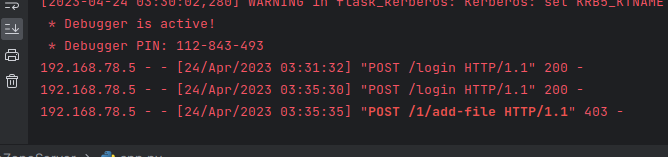

# FileZoneServer
<div id="top"></div>

## About The project

This repository contains the server for the Filezone app which is an app for storing and sharing files in a secure way using Kerberos protocol and Flask frameword.
The Flask app allows clients from remote machines to access their corresponding user's home directory in the machine hosting the Flask service.
The user must authenticate throught kerberos, so he must have a ticket to access the service.

## Configuration

We are going to use 3 machines, the server machine, the client machine and the KDC machine.
### Kerberos Configuration

#### 1. Environnement

In order to proceed with the configurations we need to have a : 
- Domain name : "filezone.com"
- Realm : "FILEZONE.COM"
- THREE machines : 

 | Machine Name     | Sub-domain name      |
 |    :---:         |    :---:             |
 | KDC              | kdc.filezone.com     |
 | server           | server.filezone.com  |
 | client           | client.filezone.com  |
 
Used to match domain name to their IP's.
```bash
nano /etc/hosts
```
and add _(for each machine)_ : 
```bash
192.168.78.xxx    kdc.filezone.com       kdc
192.168.78.xxx    server.filezone.com    server
192.168.78.xxx    client.filezone.com    client
```

#### 3. Time Synchronization
One of the three parts of the response from Kerberos is a timestamp issued by the Kerberos server.
So we must synchronize the machines using **ntp** and **ntpdate**

#### 4. Configure KDC
4.1. We need to install **the packages** _krb5-kdc_, _krb5-admin-server_ and _krb5-config_ by running : 
```bash
apt install krb5-kdc krb5-admin-server krb5-config
```
 | Prompt                  |    value         | 
 |    :---:                |     :---:        |
 | Realm                   | EXAMPLE.TN       |
 | Kerberos servers        | kdc.filezone.com   |
 | Administrative Service  | kdc.filezone.com   |

4.2 Now we need to add **kerberos database** where principals will be stored
```bash
krb5_newrealm
```
4.3 we will create an _admin principal_ , a _host principal_ and generate its keytab:
- **principal:** a unique identity to which Kerberos can assign tickets.
- **keytab:** stores long-term keys for one or more principals and allow server applications to accept authentications from clients, but can also be used to obtain initial credentials for client applications.
run the following commands:
```bash
kadmin.local                              
addprinc root/admin                       
addprinc -randkey host/kdc.filezone.com     
ktadd host/kdc.filezone.com                 
```

4.3 Grant the **admin principal** all privileges by editing `/etc/krb5kdc/kadm5.acl`:
```bash
root/admin *                             
```
4.4 restart the kerberos service by running: 
```bash
systemctl restart krb5-admin-server
```

#### 5. Configure Server and Client
5.1. We need to install **the packages** _krb5-user_, _libpam-krb5_ and _libpam-ccreds_ by running: 
```bash
apt install krb5-user libpam-krb5 libpam-ccreds
```
5.2 we will create a _host principal_ and generate its keytab by running:
```bash
kadmin                                      
addprinc -randkey host/server.filezone.com (client.filezone.com)     
ktadd host/server.filezone.com   (client.filezone.com)              
```
5.3 Next You'll have to get the TGT (Ticket Granting Ticket) so that you can authenticate later without using a password, you'll enter the password just once to get the TGT

```bash
kinit
```
You can list the tickets availabe and see that you have a TGT now
```bash
klist
```

And now we can run the client app and the server and start using the app.


WITHOUT TGT ticket we get 403 status code from the api indicating that the endpoint is secure and the user is unauthorized to use this resource.




With Ticket we can use the app 


